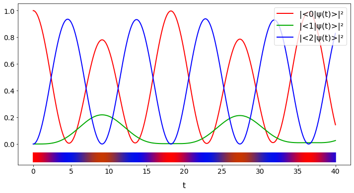

## Detector model: 3-level system

Three-level "$\Lambda$" system, of interest for 
* detector models (decay into a metastable state), 
* STIRAP
* EIT


```python
import numpy as np

import matplotlib
import matplotlib.pyplot as plt

from scipy.linalg import expm, norm

# matplotlib.rcParams['text.usetex'] = False

# https://matplotlib.org/gallery/mplot3d/lines3d.html?highlight=parametric
# This import registers the 3D projection, but is otherwise unused.
from mpl_toolkits.mplot3d import Axes3D  # noqa: F401 unused import
```


```python
from IPython.display import display, Latex #, Math
```


```javascript
%%javascript
    // do not generate scroll areas, expand figures instead
    IPython.OutputArea.auto_scroll_threshold = 9999
```


    <IPython.core.display.Javascript object>


```python
H = np.array([
    [-2,     0,      32],
    [0,      2,       8],
    [32,     8,       3]
], np.complex_) / 96
```


```python
def U(t):
    return expm(-1j*H*t)
```


```python
psi_0 = np.array([1, 0, 0], np.complex_)
```


```python
def unitary_psi(t):
    return U(t) @ psi_0
```


```python
def prob(t):
    probabilities = [0, 0, 0]
    for i in 0, 1, 2:
        probabilities[i] = norm(unitary_psi(t)[i])**2
    return probabilities
```


```python
TMIN, TMAX, TMAX_EXTENDED = 0, 40, 150
TMIN_N, TMAX_N = float(TMIN), float(TMAX)
```


```python
NPLOTPOINTS = 3200
```


```python
times = np.linspace(TMIN_N, TMAX_N, num=NPLOTPOINTS)
times_extended = np.linspace(TMIN_N, TMAX_EXTENDED, num=NPLOTPOINTS)
```


```python
probs = [None, None, None]
for i in 0, 1, 2:
    probs[i] = np.fromiter((prob(t)[i] for t in times), np.float)
    plt.plot(times, probs[i])
    plt.show()
```


    

    


    

    


    

    


```python
# Avoid *tiny* negative numbers, just out of numeric approximation, which will cause problems later,
# when their value is in fact juzt zero.
probs = np.round(probs, decimals=12)
```


```python
UNISYM = {
    'psi': u'\u03C8',
    '^2' : u'\u00B2'
}
PROB_LABELS     = ['', '', '']
PROB_AMP_LABELS = ['', '', '']
                
for i in 0, 1, 2:
    PROB_AMP_LABELS[i] = '<' + str(i) + '|' + UNISYM['psi'] + '>'
    PROB_LABELS[i]     = '|' + PROB_AMP_LABELS[i] + '|' + UNISYM['^2']
```

https://matplotlib.org/gallery/lines_bars_and_markers/stackplot_demo.html#sphx-glr-gallery-lines-bars-and-markers-stackplot-demo-py


```python
prob_stack = np.vstack(probs)
```


```python
labels = PROB_LABELS
colors = ["#cc1111", "#33aa33", "#1111cc"]

fig, ax = plt.subplots(figsize=(12, 6))
ax.stackplot(times, probs[0], probs[1], probs[2], labels=labels, colors=colors)
ax.legend(loc='lower center')
plt.show()
```


    

    


```python
rgbs = []
for i in range(NPLOTPOINTS):
    rgbs.append(
        (
            probs[0][i],
            probs[1][i],
            probs[2][i]
        )
    )
```


```python
fig, ax = plt.subplots(figsize=(12,6))
ax.set_xlabel('t')
ax.scatter(times, np.zeros(NPLOTPOINTS),
            c=rgbs, marker='|', s=40000)

# "virtual", don't really want to show, only for legend
_c = ['r', '#00f800', 'b']
for i in 0, 1, 2:
    ax.plot(
        times, probs[i],
        c=_c[i],
        linewidth=2,
    )
    
ax.legend(
    PROB_LABELS,
    loc='upper right'
)
```


    <matplotlib.legend.Legend at 0x7f80b8c24f40>


    

    


```python
unitary_psis = [np.zeros(NPLOTPOINTS)] * 3
for i in 0, 1, 2:
    unitary_psis[i] = np.fromiter( (unitary_psi(t)[i] for t in times), np.complex )
```


```python
# 3D parametric plot
for (vertical_angle, horizontal_angle, height, width) in (10, -70, 15, 35), (80, -120, 15, 35):
    fig = plt.figure(figsize=(width, height), dpi=200)


    ax = fig.gca(projection='3d')

    ax.view_init(vertical_angle, horizontal_angle) # rotate 3d point of view

    ax.set_xlabel('Re <0,1,2|\u03C8>')
    ax.set_ylabel('Im <0,1,2|\u03C8>')
    ax.set_zlabel('t')

    ax.scatter(
        np.zeros(NPLOTPOINTS, dtype=np.float),
        np.zeros(NPLOTPOINTS, dtype=np.float),
        times,

        c = rgbs,
        s = 100
    )
    for i in 0, 1, 2:
        ax.scatter(
            np.real(unitary_psis[i]),
            np.imag(unitary_psis[i]),
            times,

            marker = '.',
            #depthshade=False,
            s = (probs[i])*30,
            c = _c[i]
        )
```


    

    


    

    


## Complex potential (detection by absorption)


```python
H_n = H
```


```python
GAMMA = 0.1
```


```python
def D(_gamma=GAMMA):
    # no 1/2 factor, absorbed in the _gamma in the matrix here
    return np.array([
        [0, 0,      0],
        [0, 0,      0],
        [0, 0, _gamma]
    ], dtype=np.complex)
```


```python
D()
```


    array([[0. +0.j, 0. +0.j, 0. +0.j],
           [0. +0.j, 0. +0.j, 0. +0.j],
           [0. +0.j, 0. +0.j, 0.1+0.j]])


```python
def K(_gamma=GAMMA):
    return H_n - 1j*D(_gamma)
```


```python
K()
```


    array([[-0.02083333+0.j ,  0.        +0.j ,  0.33333333+0.j ],
           [ 0.        +0.j ,  0.02083333+0.j ,  0.08333333+0.j ],
           [ 0.33333333+0.j ,  0.08333333+0.j ,  0.03125   -0.1j]])


```python
def B(_t, _gamma=GAMMA):
    return expm(-1j*K(_gamma)*_t)
```


```python
B(0)
```


    array([[1.-0.j, 0.-0.j, 0.-0.j],
           [0.-0.j, 1.-0.j, 0.-0.j],
           [0.+0.j, 0.+0.j, 1.+0.j]])


```python
def non_unitary_psi(_t, _gamma=GAMMA):
    return B(_t, _gamma) @ psi_0
```


```python
evolution = np.zeros((3, NPLOTPOINTS), dtype=np.complex)
evolution_extended = np.zeros((3, NPLOTPOINTS), dtype=np.complex)

for i in 0, 1, 2:
    _iter = (non_unitary_psi(_t)[i] for _t in times)
    _iter_extended = (non_unitary_psi(_t)[i] for _t in times_extended)

    evolution[i] = np.fromiter(_iter, np.complex)
    evolution_extended[i] = np.fromiter(_iter_extended, np.complex)

_iter_norm = (norm(non_unitary_psi(_t)) for _t in times)
norms = np.fromiter(_iter_norm, np.float)

_iter_norm_extended = (norm(non_unitary_psi(_t)) for _t in times_extended)
norms_extended = np.fromiter(_iter_norm_extended, np.float)
```


```python
fig, ax = plt.subplots(figsize=(12, 8))

ax.plot(times, np.ones(NPLOTPOINTS), c='grey', linestyle='dashed')

ax.plot(times, norms**2, c='#cccc00', linewidth=2)

ax.stackplot(
    times,
    np.abs(evolution[0])**2,
    np.abs(evolution[1])**2,
    np.abs(evolution[2])**2,
    
    labels=labels, colors=colors
)

ax.legend(loc='lower center')

plt.show()
```


    

    


```python
# loss of normalization, or integral of antiderivative...
bayesian_denominator_nonpw = 1 - norm(evolution.T[NPLOTPOINTS-1])**2  # TODO! explain/replace
```


```python
fig, ax = plt.subplots(figsize=(12, 8))
ax.set_xlabel('t')
ax.set_ylabel('Detection probability density')
ax.plot(times, -np.gradient(norms**2, times), c='b', linewidth=2)
```


    [<matplotlib.lines.Line2D at 0x7f80b9540a00>]


    

    


```python
labels = PROB_LABELS
colors = ["#cc1111", "#33aa33", "#1111cc"]

fig, ax = plt.subplots(figsize=(14, 7))

ax.stackplot(
    times_extended,
    np.abs(evolution_extended[0])**2,
    np.abs(evolution_extended[1])**2,
    np.abs(evolution_extended[2])**2,
    
    labels=labels, colors=colors
)

ax.legend(loc='upper right')

plt.savefig('_img/detect3.021/loss3color.png', dpi=300, transparent=True, pad_inches=0)
plt.savefig('_img/detect3.021/loss3color.svg', transparent=True)
plt.show()
```


    

    


```python
fig, ax = plt.subplots(figsize=(22, 3))
ax.set_xlabel('t')
ax.set_ylabel('Detection probability density')
ax.plot(times_extended, -np.gradient(norms_extended**2, times), c='b', linewidth=1)
```


    [<matplotlib.lines.Line2D at 0x7f80a58716a0>]


    

    


## Page-Wootters


```python
from scipy.linalg import dft, norm, expm, det, inv
```


```python
# Dimension of the system, or the spatial/"ordinary" Hilbert space
NS = 3
# Number of levels of the clock aka dimension of Time Hilbert space
NT = 64
# "Period"
DT = TMAX_N  # assume we start with time 0

T = DT * np.diag(np.arange(NT)) / NT
```


```python

```


```python
F = dft(NT, scale='sqrtn').conj()
F_dagger = F.conj().T
```


```python
Omega = F @ T @ F_dagger * 2*np.pi * NT / DT**2
```


```python
J = np.kron(Omega, np.eye(3)) + np.kron(np.eye(NT), K())
```


```python
eigenvalues, eigenvectors = np.linalg.eig(J)
```


```python
eigenvectors = eigenvectors.T
```


```python
eigenvectors_normalized_in_S = np.empty((NT*NS, NT*NS), dtype=complex)

for i in range(NT*NS):
    eigenvectors_normalized_in_S[i] = eigenvectors[i] / norm(eigenvectors[i][:3])
```


```python
histories = np.empty((NT*NS, NT*NS), dtype=complex)

for i in range(NT*NS):
    histories[i] = \
        expm(np.kron( -1j*T*eigenvalues[i], np.eye(NS) )) @ \
        eigenvectors_normalized_in_S[i]
```


```python
# Only implemented for NS=3
def find_linear_independent_initial(eigenvectors=eigenvectors_normalized_in_S):
    best_i, best_j, best_k = -1, -1, -1
    best_det = 0
    best_states = np.array([
        [0, 0, 0],
        [0, 0, 0],
        [0, 0, 0]
    ])
    for i in range(NT*NS):
        for j in range(i, NT*NS):
            for k in range(j, NT*NS):
                # this normalization is not necessary if default
                # eigenvectors=eigenvectors_normalized_in_S
                # is given
                si = eigenvectors[i][:3]
                si = si / norm(si)
                sj = eigenvectors[j][:3]
                sj = sj / norm(sj)
                sk = eigenvectors[k][:3]
                sk = sk / norm(sk)
                states = np.array([
                    si,
                    sj,
                    sk
                ])
                _det = det(states)
                if abs(abs(_det)-1.0) < abs(abs(best_det) - 1.0):
                    best_det = _det
                    best_i, best_j, best_k = i, j, k
                    best_states = states
                if abs(abs(_det)-1.0) == 0:
                    return best_i, best_j, best_k, best_det
        percent = int(100 * (i + 1) / (NT*NS))
        print(
            str(percent) + '% scanned' + "\tabs(best_det) = " + str(abs(best_det)),
            end="\r", flush=True)
        
    return best_i, best_j, best_k, best_det


```


```python
best_i, best_j, best_k, best_det = find_linear_independent_initial()
```

    100% scanned	abs(best_det) = 0.9893579012772181


```python
states = np.array([
    histories[best_i][:NS],
    histories[best_j][:NS],
    histories[best_k][:NS]
])
#assert(np.round(abs(det(states)), decimals=2) == 1.0)
# Find what linear combination would bring to the desired initial state psi_0_n
coeffs = inv(states.T) @ psi_0
```


```python
history = coeffs.dot(np.array([
    histories[best_i],
    histories[best_j],
    histories[best_k]
]))
```


```python
# 3D parametric plot

times_discrete = np.diag(T)

psi = history.reshape((-1,NS)).T

for (vertical_angle, horizontal_angle, height, width) in ((10, -120, 15, 25), (80, -100, 15, 25)):
    fig = plt.figure(figsize=(width, height))


    ax = fig.gca(projection='3d')

    ax.view_init(vertical_angle, horizontal_angle) # rotate 3d point of view

    ax.set_xlabel('Re <0,1,2|\u03C8>')
    ax.set_ylabel('Im <0,1,2|\u03C8>')
    ax.set_zlabel('t')
    
    ax.scatter(
        np.zeros(NT, dtype=np.float),
        np.zeros(NT, dtype=np.float),
        times_discrete,
    
        c = np.round((abs(psi.T)**2), 8), # rounding, to aviud number instability causing out-of-range rgb vals
        s = 75,
        marker='o'
    )
    _c = ['r', 'g', 'b']
    for i in range(NS):
        ax.scatter(
            np.real(
                psi[i]
            ),
            np.imag(
                psi[i]
            ),
            times_discrete,

            marker = 's',
            #depthshade=False,
            #s = abs(_psi[i]**2)*60,
            s = 20,
            c = _c[i]
        )
```


    

    


    

    


```python
norm(psi)**2
```


    19.756605733603298


```python
norm(psi)
```


    4.444840349619241


### Overlapping  PW and QM continuous


```python
# 3D parametric plot

times_discrete = np.diag(T)

psi = history.reshape((-1,NS)).T

for (vertical_angle, horizontal_angle, height, width) in (15, -80, 15, 15), (90, -80, 15, 15):
    fig = plt.figure(figsize=(width, height), dpi=300)

    ax = fig.gca(projection='3d')

    ax.view_init(vertical_angle, horizontal_angle) # rotate 3d point of view

    ax.set_xlabel('Re <0,1,2|\u03C8>')
    ax.set_ylabel('Im <0,1,2|\u03C8>')
    ax.set_zlabel('t')
    
    ax.scatter(
        np.zeros(NT, dtype=np.float),
        np.zeros(NT, dtype=np.float),
        times_discrete,
    
        c = np.round((abs(psi.T)**2), 8), # rounding, to aviud number instability causing out-of-range rgb vals
        s = 75,
        marker='o'
    )
    _c = ['r', 'g', 'b']
    for i in range(NS):
        ax.scatter(
            np.real(
                psi[i]
            ),
            np.imag(
                psi[i]
            ),
            times_discrete,

            marker = 's',
            depthshade=False,
            #s = abs(_psi[i]**2)*60,
            s = 33,
            edgecolor = _c[i],
            facecolor='none'
        )
        
    # QM continuous
    for i in 0, 1, 2:
        ax.plot(
            np.real(evolution[i]),
            np.imag(evolution[i]),
            times,
            #depthshade=False,
            c = _c[i],
            linewidth=1
        )
```


    

    


    

    


```python

```


```python

```

## TOA prob as in Maccone/Sacha arXiv:1810.12869
_Adapted from $\S$ "Time of arbitrary event"._

See also [`detect-gentle.ipynb`](detect-gentle.ipynb). Or [`detect-gentle.py`](detect-gentle.py) if you use Jupytext.

This is based on *unitary* evolution (no complex potential) so the imaginary potential above (`GAMMA`) must be small for a good approximation.


```python
def t_eigenstate(n):
    v = np.zeros(NT, dtype=np.complex)
    v[n] = 1
    return v
```


```python
arrived_state = np.array([0, 0, 1])
```


```python
def tn_ox_arrived(n):
    return np.kron(t_eigenstate(n), arrived_state)
```


```python
history_normalized = history / norm(history)  ## normalized in H_T \otimes H_S
```


```python
def joint_prob(n):
    return np.abs(tn_ox_arrived(n) @ history_normalized)**2
```


```python
X = np.arange(NT)

iterable = (joint_prob(n) for n in X)
Y = np.fromiter(iterable, float)
```


```python
dT  = DT / (NT)
```


```python
# A "time bin"
X = X * dT # real time
Y = Y / dT # probability _density_
```


```python
bayes_denominator = np.sum(Y * dT)
Y = Y / bayes_denominator
```


```python
fig, ax = plt.subplots(figsize=(12, 8), dpi=300)
ax.plot(X, Y, 'bs', )
ax.plot(times, -np.gradient(norms**2, times) / bayesian_denominator_nonpw, c='y', linewidth=2)
plt.show()
```


    

    


```python
times[-1]
```


    40.0


```python
nonpw_probs = -np.gradient(norms**2, times) / bayesian_denominator_nonpw
```


```python
np.sum(nonpw_probs*times[1])
```


    1.0000197507624178


```python
np.sum(Y*dT)
```


    1.0


```python

```
