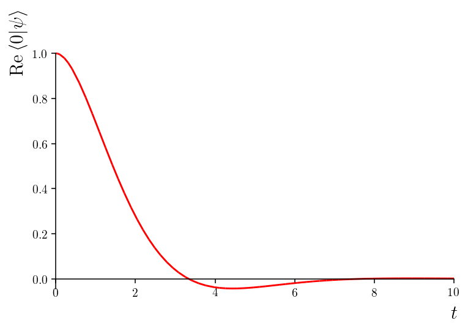
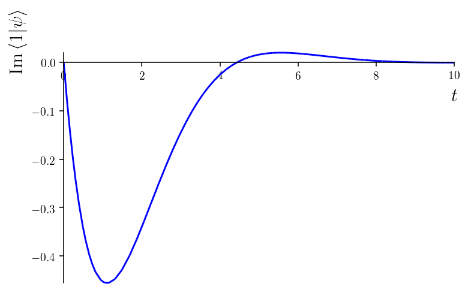
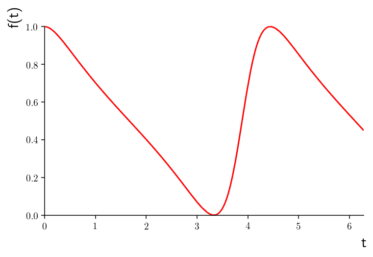
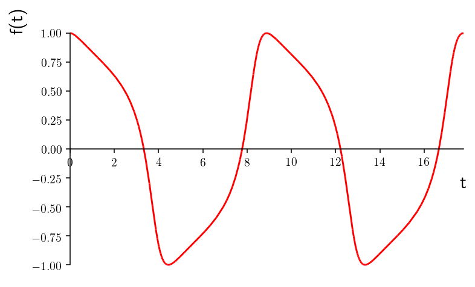
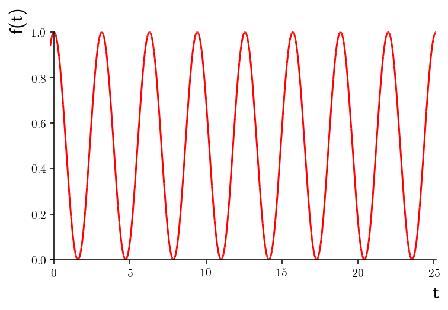
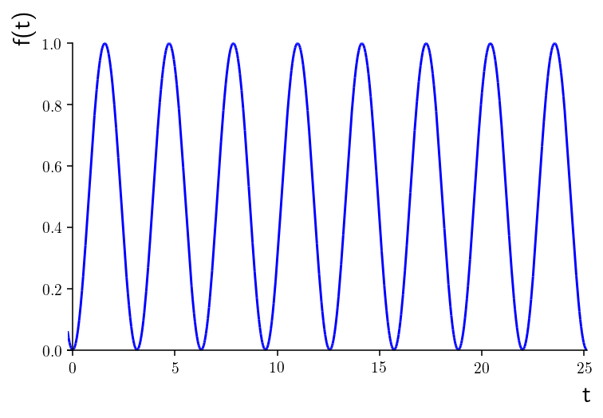

## Detector model: Kiukas / Ruschhaupt / Schmidt / Werner


```python
from sympy import *
#from sympy.physics.matrices import mdft
from sympy.physics.quantum import TensorProduct
from sympy.functions.special.delta_functions import Heaviside
from sympy.physics.quantum.dagger import Dagger

from sympy.stats import ContinuousRV, variance, std

from sympy.plotting import plot, plot3d_parametric_line

import numpy as np
import matplotlib
import matplotlib.pyplot as plt

matplotlib.rcParams['text.usetex'] = True
#matplotlib.rcParams['text.latex.preamble'] = r'''
#    \usepackage{DejaVuSans}
#    \usepackage{xparse}
#    \usepackage{amsmath}
#    \usepackage{physics}
#'''
#matplotlib.rcParams['mathtext.fontset'] = 'dejavusans'
#matplotlib.rcParams['mathtext.default'] = 'sf'
matplotlib.rcParams['figure.dpi'] = 140
# matplotlib.rcParams['figure.figsize'] = (8,8/sqrt(2))
matplotlib.rcParams['axes.labelsize'] = 16

# https://matplotlib.org/gallery/mplot3d/lines3d.html?highlight=parametric
# This import registers the 3D projection, but is otherwise unused.
from mpl_toolkits.mplot3d import Axes3D  # noqa: F401 unused import

```


```python
gamma = Symbol('gamma', real=True)
t = Symbol('t', real=True)
tprime = Symbol('t\'', real=True)
omega = Symbol('omega', real=True)
nu = Symbol('nu', real=True)
```


```python
def D(_gamma):
    return Rational(1, 2) * Matrix([
        [0, 0],
        [0, _gamma]
    ])
```


```python
H = Matrix ([
[0, 1] ,
[1, 0]
])
```


```python
init_printing ()

```


```python
H
```


$$\left[\begin{matrix}0 & 1\\1 & 0\end{matrix}\right]$$


```python
H.eigenvects()
```


$$\left [ \left ( -1, \quad 1, \quad \left [ \left[\begin{matrix}-1\\1\end{matrix}\right]\right ]\right ), \quad \left ( 1, \quad 1, \quad \left [ \left[\begin{matrix}1\\1\end{matrix}\right]\right ]\right )\right ]$$


It's manually seen that $\langle H \rangle = 0$ and $\langle H^2 \rangle = 1$, therefore $\sigma_{H} = 1$.


```python
def K(_gamma):
    return H - I*D(_gamma)
```


```python
K(2*sqrt(2))
```


$$\left[\begin{matrix}0 & 1\\1 & - \sqrt{2} i\end{matrix}\right]$$


```python
K(2*sqrt(2)).eigenvects()
```


$$\left [ \left ( - \frac{\sqrt{2}}{2} - \frac{\sqrt{2} i}{2}, \quad 1, \quad \left [ \left[\begin{matrix}- \frac{1}{\frac{\sqrt{2}}{2} + \frac{\sqrt{2} i}{2}}\\1\end{matrix}\right]\right ]\right ), \quad \left ( \frac{\sqrt{2}}{2} - \frac{\sqrt{2} i}{2}, \quad 1, \quad \left [ \left[\begin{matrix}- \frac{1}{- \frac{\sqrt{2}}{2} + \frac{\sqrt{2} i}{2}}\\1\end{matrix}\right]\right ]\right )\right ]$$


```python
def B(_gamma):
    return lambda t: exp(-I*K(_gamma)*t)
```


```python
def U():
    return lambda t: exp(-I*H*t)
```


```python
def non_unitary_psi(_t):
    return B(2*sqrt(2))(_t) * Matrix([1,0])
```


```python
def unitary_psi(_t):
    return U()(_t) * Matrix([1,0])
```


```python
non_unitary_psi(t)
```


$$\left[\begin{matrix}\frac{\sqrt{2} i t e^{- \frac{\sqrt{2} t}{2} - \frac{\sqrt{2} i t}{2}}}{2 \left(\frac{\sqrt{2} t}{2} + \frac{\sqrt{2} i t}{2}\right)} - \frac{\sqrt{2} i t e^{- \frac{\sqrt{2} t}{2} + \frac{\sqrt{2} i t}{2}}}{2 \left(\frac{\sqrt{2} t}{2} - \frac{\sqrt{2} i t}{2}\right)}\\\frac{\sqrt{2} e^{- \frac{\sqrt{2} t}{2} - \frac{\sqrt{2} i t}{2}}}{2} - \frac{\sqrt{2} e^{- \frac{\sqrt{2} t}{2} + \frac{\sqrt{2} i t}{2}}}{2}\end{matrix}\right]$$


New period


```python
2*pi / (sqrt(2)/2)
```


$$2 \sqrt{2} \pi$$


Components are either pure real or pure imaginary:


```python
plot(re(non_unitary_psi(t)[0]), (t, 0, 10),
     line_color='r', xlabel=r'$t$', ylabel=r'$\mathrm{Re}\left\langle 0 | \psi \right\rangle $')
```





    <sympy.plotting.plot.Plot at 0x7fe25ffc9898>


```python
plot(im(non_unitary_psi(t)[1]), (t, 0, 10),
     line_color='b', xlabel=r'$t$', ylabel=r'$\mathrm{Im}\left\langle 1 | \psi \right\rangle $')
```





    <sympy.plotting.plot.Plot at 0x7fe25fec1780>


```python
# verify that our manual simplification is correct
#plot(-sqrt(2)*exp(-t*sqrt(2)/2)*sin(t*sqrt(2)/2), (t, 0, 10) )
```


```python
def lossy_norm(_t):
    psi = B(2*sqrt(2))(_t) * Matrix([1,0])
    return (abs(psi[0]**2) + abs(psi[1]**2))
```


```python
lossy_norm(t)
```


$$\left|{\left(\frac{\sqrt{2} e^{- \frac{\sqrt{2} t}{2} - \frac{\sqrt{2} i t}{2}}}{2} - \frac{\sqrt{2} e^{- \frac{\sqrt{2} t}{2} + \frac{\sqrt{2} i t}{2}}}{2}\right)^{2}}\right| + \left|{\left(\frac{\sqrt{2} i t e^{- \frac{\sqrt{2} t}{2} - \frac{\sqrt{2} i t}{2}}}{2 \left(\frac{\sqrt{2} t}{2} + \frac{\sqrt{2} i t}{2}\right)} - \frac{\sqrt{2} i t e^{- \frac{\sqrt{2} t}{2} + \frac{\sqrt{2} i t}{2}}}{2 \left(\frac{\sqrt{2} t}{2} - \frac{\sqrt{2} i t}{2}\right)}\right)^{2}}\right|$$


```python
non_unitary_psi_n = lambdify(t, non_unitary_psi(t), "numpy")
```


```python
_lossy_norm_n = lambdify(t, lossy_norm(t), "numpy")
def lossy_norm_n(__t):
    # prevent a warning, even if we know it's real
    return np.real(_lossy_norm_n(__t))
```


```python
lossy_norm_n
```


    <function __main__.lossy_norm_n(__t)>


```python
def non_unitary_psi_renorm_n(_t):
    return non_unitary_psi_n(_t) / np.sqrt(lossy_norm_n(_t))
```


```python
T = np.linspace(1e-16, 2*np.pi, 2000)
```


```python
fig = plt.figure(figsize=(8,8))
#fig = plt.figure()


ax = fig.gca(projection='3d')
ax.view_init(10,-45) # rotate 3d point of view

ax.plot(
    np.real(non_unitary_psi_n(T)[0][0]), np.imag(non_unitary_psi_n(T)[1][0]), T,
    linewidth=1.25
)

##ax.legend()

plt.xlabel(r'$\mathrm{Re}\left\langle 0 | \psi \right\rangle$ (pure real)', labelpad=8)
plt.ylabel(r'$\mathrm{Im}\left\langle 1 | \psi \right\rangle$ (pure imag)', labelpad=10)
ax.set_zlabel(r'$t$')

```


    Text(0.5, 0, '$t$')


```python
plot(lossy_norm(t),(t, 0, 2*pi), line_color='g',
     ylabel=r'$\left|\psi\right|^2$', xlabel=r'$t$')
```


    <sympy.plotting.plot.Plot at 0x7fe25fe6a6a0>


```python
def prob_0_detect(t):
    return abs(non_unitary_psi(t)[0]**2) / lossy_norm(t)
```


```python
def prob_1_detect(t):
    return abs(non_unitary_psi(t)[1]**2) / lossy_norm(t)
```


```python
plot(prob_0_detect(t),(t, 0, 2*pi), line_color='r')
```





    <sympy.plotting.plot.Plot at 0x7fe25fddca20>


```python
plot(prob_1_detect(t),(t, -0, 2*pi), line_color='b')
```


    <sympy.plotting.plot.Plot at 0x7fe25fd87ac8>


```python
plot(re(non_unitary_psi(t)[0])/sqrt(lossy_norm(t)), (t, 0, 2 * 2*sqrt(2)*pi), line_color='r')
```





    <sympy.plotting.plot.Plot at 0x7fe25fd03128>


```python
plot(im(non_unitary_psi(t)[1])/sqrt(lossy_norm(t)), (t, 0, 2 * 2*sqrt(2)*pi), line_color='b')
```


    <sympy.plotting.plot.Plot at 0x7fe25f98eeb8>


```python
plot(prob_0_detect(t) + prob_1_detect(t),(t, -0.25, 8*pi))
```


    <sympy.plotting.plot.Plot at 0x7fe261980c50>


```python
def prob_0_unitary(t):
    return abs(unitary_psi(t)[0]**2)
```


```python
def prob_1_unitary(t):
    return abs(unitary_psi(t)[1]**2)
```


```python
plot(prob_0_unitary(t),(t, -0.25, 8*pi), line_color='r')
```





    <sympy.plotting.plot.Plot at 0x7fe261a495c0>


```python
plot(prob_1_unitary(t),(t, -0.25, 8*pi), line_color='b')
```





    <sympy.plotting.plot.Plot at 0x7fe25ff64710>


```python
lossy_norm_n(2)
```


$$0.19265133139031912$$


```python
X = np.linspace(1e-6, 2*np.pi, 1000)  # avoid singularity in t=0
```


```python
Y = lossy_norm_n(X)
```


```python
plt.xlabel('$t$')
plt.ylabel(r'$ - \mathrm{d}|\psi|^2 / \mathrm{d}t $')
plt.plot(X, -np.gradient(Y, X), 'g')

```


    [<matplotlib.lines.Line2D at 0x7fe25f7ddba8>]


```python
# we have set gamma = 2*sqrt(2)
def hatpsi(_t):
    return \
        Heaviside(_t) * \
        2**(Rational(3,4)) * \
        Matrix([
            [0, 0],
            [0, 1]
        ]) * \
        non_unitary_psi(_t)

def hatpsi_n(_t):
    return \
        np.heaviside(_t, 0) * \
        2**(3/4) * \
        np.array([
            [0, 0],
            [0, 1]
        ]) * \
        non_unitary_psi_n(_t)


```


```python
hatpsi(t)
```


$$\left[\begin{matrix}0\\2^{\frac{3}{4}} \left(\frac{\sqrt{2} e^{- \frac{\sqrt{2} t}{2} - \frac{\sqrt{2} i t}{2}}}{2} - \frac{\sqrt{2} e^{- \frac{\sqrt{2} t}{2} + \frac{\sqrt{2} i t}{2}}}{2}\right) \theta\left(t\right)\end{matrix}\right]$$


```python
def hatpsisquarednorm(_t):
    return abs(hatpsi(_t)[0]**2) + abs(hatpsi(_t)[1]**2)

def hatpsisquarednorm_n(_t):
    return abs(hatpsi_n(_t)[0]**2) + abs(hatpsi_n(_t)[1]**2)
```


```python
hatpsisquarednorm(-1)
```


$$0$$


```python
plot(hatpsisquarednorm(t), (t, -1, 2*pi), line_color='g',
     ylabel=r'$ \left|\hspace{-.15em}\left|\hat{\psi}\right|\hspace{-.15em}\right|^2 $ =  $ - \mathrm{d}\left|\hspace{-0.15em}\left|\psi\right|\hspace{-0.15em}\right|^2 / \mathrm{d}t $',
     xlabel=r'$t$'
    )
```


    <sympy.plotting.plot.Plot at 0x7fe25f7b05f8>


```python
#plot(prob_1_detect(t), hatpsisquarednorm(t), (t, -0.25, 8*pi))
```


```python
def prob_0_hatpsi(_t):
    return abs(hatpsi(_t)[0]**2) / (abs(hatpsi(_t)[0]**2) + abs(hatpsi(_t)[1]**2))
```


```python
def prob_1_hatpsi(_t):
    return abs(hatpsi(_t)[1]**2) / (abs(hatpsi(_t)[0]**2) + abs(hatpsi(_t)[1]**2))
```


```python
plot( abs(hatpsi(t)[1]**2), (t, -2, 2*pi), line_color='b')
```


    <sympy.plotting.plot.Plot at 0x7fe25f7797f0>


```python
def fhatpsi1(_nu):
    return fourier_transform(hatpsi(t)[1], t, _nu)
```


```python
simplify(fhatpsi1(nu))
```


$$- \frac{2^{\frac{3}{4}} i}{- 4 \pi^{2} \nu^{2} + 2 \sqrt{2} i \pi \nu + 1}$$


```python
plot(abs(fhatpsi1(nu))**2, (nu, -1, 1), line_color='#bbbbbb')
```


    <sympy.plotting.plot.Plot at 0x7fe25f63ac18>


The above Fourier transform is defined in frequency (\nu) not angular frequency (\omega),
therefore needs rescaling.


```python
def fhatpsiomega(_omega):
    return fhatpsi1(_omega/(2*pi)) / sqrt((2*pi))
```


```python
fhatpsiomega(omega)
```


$$- \frac{\sqrt[4]{2} i}{\sqrt{\pi} \left(- \omega^{2} + \sqrt{2} i \omega + 1\right)}$$


```python
abs(fhatpsiomega(omega))**2
```


$$- \frac{\sqrt{2}}{\pi \left(- \omega^{4} - 1\right)}$$


```python
integrate(abs(fhatpsiomega(omega))**2, (omega, -oo, +oo))
```


$$1$$


```python
plot(abs(fhatpsiomega(omega))**2, (omega, -2*pi, 2*pi), line_color='magenta',
     xlabel=r'$\omega$', ylabel=r'$P(\omega)$')
```


    <sympy.plotting.plot.Plot at 0x7fe25dad3860>


```python
# graphical comparison with a normalized gaussian
sigma = 1.0
plot((1/(sqrt(2*pi)*sigma)) * exp(-omega**2/(2*(sigma)**2)), (omega, -2*pi, 2*pi), line_color='magenta')
```


    <sympy.plotting.plot.Plot at 0x7fe25dae10f0>


## (Discrete) Page-Wootters model


```python
from scipy.linalg import dft, norm, expm
from scipy import stats
```


```python
T = np.diag(np.arange(0,32)) * np.pi / 16
```


```python
# The NumPy Fourier matrix is the conjugate of Mathematica's one,
# hence the trailing .conj()
F = dft(32, scale='sqrtn').conj()
```


```python
F_dagger = F.conj().T
```


```python
Omega = F @ T @ F_dagger * 16 / np.pi
```


```python
oeigenvalues, oeigenvectors = np.linalg.eig(Omega)
```


```python
np.round(oeigenvalues)
```


    array([-0.+0.j, 31.+0.j,  1.+0.j, 30.+0.j,  2.+0.j, 29.-0.j,  3.+0.j,
           28.-0.j,  4.-0.j, 27.-0.j,  5.-0.j, 26.+0.j,  6.-0.j, 25.+0.j,
            7.-0.j,  8.+0.j, 24.+0.j,  9.-0.j, 23.+0.j, 10.+0.j, 22.+0.j,
           11.+0.j, 21.-0.j, 12.+0.j, 13.-0.j, 20.-0.j, 14.-0.j, 15.-0.j,
           19.+0.j, 16.-0.j, 17.+0.j, 18.-0.j])


```python
H = np.array([
    [0, 1],
    [1, 0]
])
```


```python
D = np.array([
    [0, 0],
    [0, np.sqrt(2)]
])
```


```python
K = H - 1j*D
```


```python
K
```


    array([[0.+0.j        , 1.+0.j        ],
           [1.+0.j        , 0.-1.41421356j]])


```python
J = np.kron(Omega, np.eye(2)) + np.kron(np.eye(32), K)
```


```python
eigenvalues, eigenvectors = np.linalg.eig(J)
```


```python
EnergyCorrectionMatrices = np.zeros((64, 64, 64), np.complex)
for n in range(64):
    #EnergyCorrectionMatrices[n] = np.kron(
    #    expm(-1j*eigenvalues[n]*T),
    #    np.eye(2)
    #)
    EnergyCorrectionMatrices[n] = expm(-1j*eigenvalues[n]*np.kron(T, np.eye(2)))
# TODO: DRY
EnergyCorrectionMatricesT = np.zeros((64, 32, 32), np.complex)
for n in range(64):
    EnergyCorrectionMatricesT[n] = expm(-1j*eigenvalues[n]*T)

```


```python
def history_vector(eigenindex):
    # Needs matrix transposition ".T" (different convention as opposed to Mathematica)
    eigenvector = eigenvectors.T[eigenindex]
    return EnergyCorrectionMatrices[eigenindex] @ eigenvector

# "unflatten" the history_vector v into a a sequence of qubit component pairs
def reshape(v):
    return np.reshape(v, (-1,2))

# also make the first component real
def normalize_initial(v):
    vout = np.zeros(64, np.complex)
    # A phase factor to make it real
    vout = v * np.exp(-1j * np.angle(v[0]))
    # And a factor to normalize the initial state
    vout = vout / sqrt(
        np.abs(vout[0]**2) + np.abs(vout[1]**2)
    )
    return vout
```


```python
# Find the best linear combination to obtain |0> as initial state
def find_best():
    max_prob0 = 0
    max_prob0_i = 0
    max_prob0_j = 0
    for i in range(32):
        for j in range(32):
            qbi = reshape(history_vector(i))
            qbj = reshape(history_vector(j))
            qbit_hist = qbi + qbj
            prob0 = np.abs(qbit_hist[0][0]**2) / (
                np.abs(qbit_hist[0][0]**2) + np.abs(qbit_hist[0][1]**2)
            )
            if prob0 > max_prob0:
                max_prob0 = prob0
                max_prob0_i = i
                max_prob0_j = j
    print (max_prob0_i, max_prob0_j, max_prob0)
    return (max_prob0_i, max_prob0_j)

```


```python
# start with |0> as close as possible
i, j = find_best()
qbhistvec = normalize_initial(history_vector(i) + history_vector(j))
qbhist = reshape(qbhistvec)
```

    1 21 1.0


```python
qbhist = qbhist.astype(complex)
```

Consitently with "odinary QM" findings, the component along |0> stays purely real, and the component along |1> stays purely imaginary.


```python
# Fill data for plotting
times = np.arange(0, 2*np.pi, np.pi/16)
norms = np.zeros(32)
probs0 = np.zeros(32)
probs1 = np.zeros(32)
# Components 0 are pure real, componets 1 are pure imag
real_parts0 = np.real(qbhist.T[0])
imag_parts1 = np.imag(qbhist.T[1])

for i in range(0, 32):
    norms[i] = (np.abs(qbhist[i][0]**2) + np.abs(qbhist[i][1]**2))
    probs0[i] = np.abs(qbhist[i][0]**2) / (
        np.abs(qbhist[i][0]**2) + np.abs(qbhist[i][1]**2) )
    probs1[i] = np.abs(qbhist[i][1]**2) / (
        np.abs(qbhist[i][0]**2) + np.abs(qbhist[i][1]**2) )
```


```python
plt.ylabel(r'$\mathrm{Re}{\;}_{T}\hspace{-.2em}\left\langle t | {}_{S}\hspace{-.2em}\left\langle 0 | \Psi \right\rangle\hspace{-.17em}\right\rangle $')
plt.xlabel(r'$t$')
plt.plot(times, real_parts0/norms[0], 'rs')
```


    [<matplotlib.lines.Line2D at 0x7fe25d36e438>]


```python
plt.ylabel(r'$\mathrm{Im}{\;}_{T}\hspace{-.2em}\left\langle t | {}_{S}\hspace{-.2em}\left\langle 1 | \Psi \right\rangle\hspace{-.17em}\right\rangle $')
plt.xlabel(r'$t$')
plt.plot(times, imag_parts1/norms[0], 'bs')
```


    [<matplotlib.lines.Line2D at 0x7fe25d27da90>]


```python
plt.plot(times, norms/norms[0], 'g^')
```


    [<matplotlib.lines.Line2D at 0x7ff538fd94e0>]


```python
plt.plot(times, probs0, 'rs')
```


    [<matplotlib.lines.Line2D at 0x7ff538f341d0>]


```python
plt.plot(times, probs1, 'bs')
```


    [<matplotlib.lines.Line2D at 0x7ff538f05f60>]


```python
fig = plt.figure(figsize=(7,7))

#ax = fig.gca(projection='3d')
ax = fig.add_subplot(111, projection='3d')
ax.view_init(10,-45) # rotate 3d point of view

ax.scatter(
    real_parts0, imag_parts1, times
)

##ax.legend()

plt.xlabel(r'$\mathrm{Re}\left\langle 0 | \psi \right\rangle$ (pure real)')
plt.ylabel(r'$\mathrm{Im}\left\langle 1 | \psi \right\rangle$ (pure imag)')
ax.set_zlabel('t')

```


    Text(0.5, 0, 't')


## Detection event


```python
sqr2D = np.array([
    [0, 0],
    [0, 2**(3/4)]
])
```


```python
qbhistvec = qbhistvec.astype(np.complex)
```


```python
sqr2D = sqr2D.astype(np.complex)
```


```python
#prob_detect_v = np.kron(np.eye(32), sqr2D) @ qbhistvec
#
# More direct route, without going through histories
i, j = find_best()
prob_detect_v = \
    (np.kron(EnergyCorrectionMatricesT[i], sqr2D) @ eigenvectors.T[i]) + \
    (np.kron(EnergyCorrectionMatricesT[j], sqr2D) @ eigenvectors.T[j])

# normalize
prob_detect_v = prob_detect_v / norm(prob_detect_v)


```

    1 21 1.0


```python
prob_detect = np.zeros(32)
for t_idx in range(32):
    prob_detect[t_idx] = \
        np.abs(prob_detect_v[2*t_idx])**2 + np.abs(prob_detect_v[2*t_idx+1])**2
```


```python
plt.plot(times, prob_detect * 16 / np.pi, 'bs')
```


    [<matplotlib.lines.Line2D at 0x7ff538e5b550>]


```python
detect_fft = \
    np.kron(F, np.eye(2)) @ prob_detect_v
detect_fft = detect_fft / norm(detect_fft)
```


```python
prob_detect_fft = np.zeros(32)
for o in range(32):
    prob_detect_fft[o] = \
        np.abs(detect_fft[2*o]**2) + \
        np.abs(detect_fft[2*o + 1]**2)
```


```python
# Arrays are "rolled" because the second half
# of the spectrum is identified with
# negative frequencies.
plt.plot(range(-16, 16), np.roll(prob_detect_fft, -16), 'y^')
```


    [<matplotlib.lines.Line2D at 0x7ff538db5ac8>]


```python
S_t = stats.entropy(prob_detect)
```


```python
S_omega = stats.entropy(prob_detect_fft)
```


```python
S_t
```


$$2.6193337590390438$$


```python
S_omega
```


$$1.3471684169765332$$


```python
S_t * S_omega
```


$$3.528683713697821$$


```python
np.log(32)
```


$$3.4657359027997265$$


```python
(S_t * S_omega - np.log(32)) / np.log(32)
```


$$0.01816289892349938$$


Only 1.8% more than the minumum per entropic uncertainty relation.

### Use Scipy routines to compute sigmas


```python

xk = range(-16,16)
pk = np.roll(prob_detect_fft, -16)
detect_fft_pdist = stats.rv_discrete(name='prob_detect_fft_minus16', values=(xk, pk))
```


```python
sigma_omega = detect_fft_pdist.std()
```


```python
xk = times
pk = prob_detect
detect_pdist = stats.rv_discrete(name='prob_detect', values=(xk, pk))
```


```python
sigma_t = detect_pdist.std()
```


```python
sigma_t * sigma_omega
```


$$0.7159703170687718$$


It's still quite a bit more than 0.5, i.e. the minimum uncertainty...

But this is in fact consistent with the paper.
